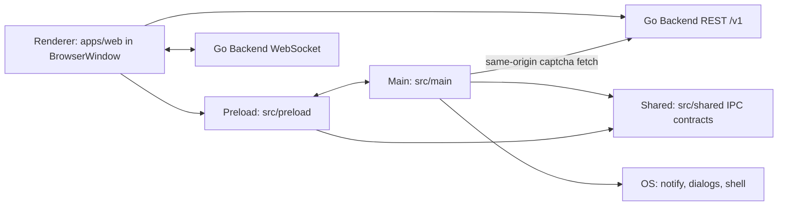

# Qchat Desktop architecture

Thin Electron shell around the Qchat **web** client (`apps/web`), using a
main / preload / shared separation — without embedding a
local React UI (the renderer is the remote Next.js app).

## Process diagram



## Responsibilities

| Layer | Path | Responsibility |
|---|---|---|
| **Main** | `src/main/` | App lifecycle, `BrowserWindow`, menus, notifications, downloads, permissions, navigation guards, IPC handlers |
| **Preload** | `src/preload/` | Narrow `contextBridge` API as `window.qchatDesktop` (no raw `ipcRenderer`) |
| **Shared** | `src/shared/` | IPC channel names + app constants safe for main and preload |
| **Renderer** | remote `apps/web` | All chat UI, REST, WebSocket, auth tokens in web storage — **not** vendored into this package |
| **Go backend** | `services/api` | Unchanged; desktop must not alter API contracts |

## Folder tree

```text
apps/desktop/
├── assets/
├── production.json
├── package.json          # main → src/main/index.js
├── run.sh
├── src/
│   ├── main/
│   │   ├── index.js
│   │   ├── app/
│   │   │   ├── lifecycle.js
│   │   │   └── configuration/
│   │   │       ├── paths.js
│   │   │       └── webUrl.js
│   │   ├── windows/
│   │   │   └── mainWindow.js
│   │   ├── ipc/handlers/
│   │   ├── native/         # menu, about
│   │   ├── security/       # permissions, navigation
│   │   └── services/       # downloads
│   ├── preload/
│   │   └── index.js
│   └── shared/
│       ├── constants.js
│       └── ipc/channels.js
└── …
```

Empty folders (tray, updater, local renderer features) are
**omitted** until those features exist.

## IPC data flow

1. Web calls `window.qchatDesktop.notifyMessage(payload)`.
2. Preload `invoke`s channel `qchat:desktop-notify` (from `shared/ipc/channels`).
3. Main handler validates payload shape, shows `Notification`, on click focuses window and `send`s `qchat:open-conversation`.
4. Preload `onOpenConversation` delivers the id to web.

Channels are defined once in `src/shared/ipc/channels.js`.

## REST / WebSocket

- Chat REST and WebSocket stay in **`apps/web`** (same as browser).
- Desktop main only performs **captcha** `GET {webUrl}/v1/auth/captcha` to avoid renderer CORS issues — path and response shape unchanged.

## Auth / tokens

- Tokens remain in the web renderer (localStorage / cookies as implemented by web).
- Preload does **not** expose tokens, filesystem, or generic IPC send.
- Future `safeStorage` would live under `src/main/security/` and a narrow preload method (ask before touching web).

## Security settings (preserved)

```js
contextIsolation: true
nodeIntegration: false
sandbox: true
```

External / off-origin navigations open in the OS browser.

## Adding a new IPC method

1. Add channel name to `src/shared/ipc/channels.js`.
2. Add handler under `src/main/ipc/handlers/` and register in `handlers/index.js`.
3. Expose one explicit function in `src/preload/index.js` (no generic `send`).
4. If web must call it, coordinate a small change in `apps/web` (separate branch / ask owner).

## Adding a “renderer feature”

There is no local renderer package. Implement UI in `apps/web` (Hitman). Desktop only adds OS integrations via IPC when needed.
